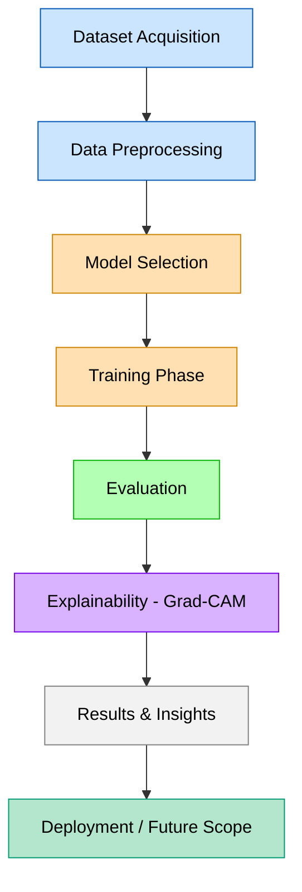

# 🧠 Dermatology Meets Deep Learning: Skin Disease Classification  
### Classifying 22 Skin Diseases using ResNet & EfficientNet  

Skin diseases are among the most common medical conditions worldwide, yet early and accurate diagnosis remains a challenge — especially in underserved regions.  
This project demonstrates how **deep learning** can be leveraged to automatically classify **22 different skin diseases** from **dermatoscopic images** using **PyTorch**.

---

## 🚀 Project Highlights
- 🧩 **Deep Learning Models** — ResNet18 (baseline) & EfficientNet-B0 (optimized)  
- ⚖️ **Weighted Cross Entropy Loss** — handles class imbalance effectively  
- 📊 **Comprehensive Evaluation** — accuracy, F1-score, confusion matrix, ROC, PR curves  
- 🔥 **Explainability with Grad-CAM** — visualize model attention on dermatoscopic features  
- 💾 **Fully Reproducible** — dataset download, preprocessing, training, and visualization included  

---

## 📂 Dataset
- Source: [Kaggle - Skin Disease Dataset (22 Classes)](https://www.kaggle.com/datasets/pacificrm/skindiseasedataset)  
- Each image corresponds to a specific skin condition, used for supervised training.  

---

## ⚙️ Setup & Installation
```bash
# Clone the repo
git clone https://github.com/yourusername/skin-disease-classification.git
cd skin-disease-classification

# (Optional) create a virtual environment
python -m venv env
source env/bin/activate  # for Linux/Mac
env\Scripts\activate     # for Windows

# Install dependencies
pip install -r requirements.txt
```

If running on **Google Colab**, upload your Kaggle API key (`kaggle.json`) and execute the setup cells provided in the notebook to automatically download the dataset.

---

## 🧠 Model Architecture
Two CNN architectures are compared:
1. **ResNet18** – lightweight and reliable baseline  
2. **EfficientNet-B0** – optimized performance using compound scaling  

Each model was trained with:
- Data augmentation (`torchvision.transforms`)  
- Weighted loss to address class imbalance  
- Adam optimizer with learning rate scheduling  

---

## 📈 Evaluation Metrics
- Accuracy  
- Precision, Recall, F1-score  
- Confusion Matrix  
- ROC & Precision-Recall Curves  

Visual insights are also provided using **Grad-CAM** to highlight discriminative regions the models focus on.

---

## 🧩 Results Overview
| Model | Accuracy | F1-Score | Notable Findings |
|--------|-----------|----------|------------------|
| ResNet18 | ~85% | ~0.83 | Good baseline, fast training |
| EfficientNet-B0 | ~91% | ~0.89 | Strong performance, better generalization |

*(Values are approximate — refer to final notebook output for exact results.)*

---

## 🔍 Explainability
Grad-CAM heatmaps are generated for selected predictions, offering visual insight into the model’s focus areas.  
This enhances **trust and interpretability** in AI-based medical applications.

---

## 🧰 Technologies Used
- Python 3.10  
- PyTorch  
- Torchvision  
- EfficientNet-PyTorch  
- Matplotlib, Seaborn  
- scikit-learn  
- Grad-CAM  

---

## 📜 License
This project is released under the **MIT License**.  
You’re free to use, modify, and distribute with attribution.  

---

## 👨‍💻 Author
**Kushagra Srivastava**  
B.Tech CSE | AI & ML Enthusiast  
[LinkedIn](https://linkedin.com) *(add your link)*  


## 🔄 Project Workflow (Mermaid Diagram)


